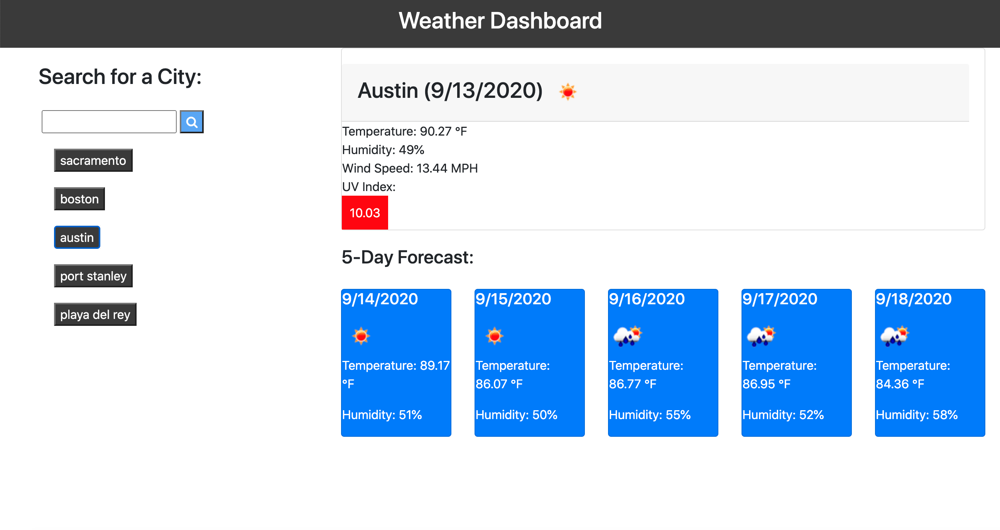

# Weather Forecast

This app gives you a 5-day weather forecast for any city in the world!

## Description

Type in the city you would like to see the weather for. It will tell you the temperature, humidity, windspeed, and UV Index.  The UV Index is color-coded based on severity. 

Your previous searches will save to the left, as clickable buttons.  You can click these to reload their weather forecasts.  

## How it's built

This application uses Bootstrap to create the weather and forecast cards.  I used a combination of Javascript and Jquery to create to buttons, and the functions to generate the weather.  The biggest tool was use of a server-side API to fetch current weather.  The API I used is a weather API, called Open Weather Map - I would definitely recommend it.  

## Enjoy!

Here is a preview of theweather app:  

Try it out!
https://suzannaakins.github.io/weather-forecast/